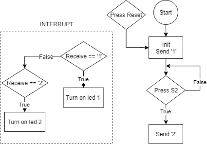

# MSP430G2553
Some tiny projects about MSP430 in Embedded System Course

- Lab 02 : Morse Project ( Using Led to blink International Morse Code - 0 Red Led , 1 Green Led)
- Lab 03 : Using Two Buttons (Using two buttons on MSP430 to control leds - 1 normal button , 1 reset button )
- Lab 04 : Communicate Two Boards via UART (Using two boards to control led via String with Uart protocol - STOP to turn off led , ACTIVE to turn on Led in few second )

# Lab02 Video: https://youtu.be/piFyOXasewM
# Lab03 Video: https://youtu.be/xWw3ayrXHac
# Lab04 Video: https://youtu.be/73ztqIzN0GE
# MSP430G2553 Playlist: https://www.youtube.com/playlist?list=PL9FegcZTeB9K8FHeJSVNtj-8xc1gCY-We

- Lab02 Diagram:

- Lab03 Diagram:

- Lab04 Diagram:

